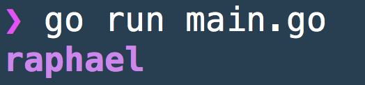

# go-rainbow [](https://travis-ci.org/raphamorim/go-rainbow)

Extremely inspired by [chalk.js](https://github.com/chalk/chalk)

`go-rainbow` allows you to: 

- Iterate modifiers and colors on a String.
- Use HEX as you wish.
- Use from Int as you wish.
- Use RGB as you wish (work in progress).
- Bring magical Rainbow on a String (work in progress).


# Summary

- [Install](#install)
- [Example](#example)
- [Hex](#hex)
- [FromInt32](#fromint32)
- [Iterables](#iterables)
- [Modifiers](#modifiers)
  - Bold
  - Dim
  - Italic
  - Underline
  - Reverse
  - Hidden
- [Colors](#colors)
  - `Black`
  - `Red`
  - `Green`
  - `Yellow`
  - `Blue`
  - `Magenta`
  - `Cyan`
  - `White`
- [Background Colors](#background-colors)
  - `BgBlack`
  - `BgRed`
  - `BgGreen`
  - `BgYellow`
  - `BgBlue`
  - `BgMagenta`
  - `BgCyan`
  - `BgWhite`

## Install

```bash
go get github.com/raphamorim/go-rainbow
```

## Example

**main.go**

```go
package main
import (
    "fmt"

    "github.com/raphamorim/go-rainbow"
)

func main() {
    fmt.Println(rainbow.Bold(rainbow.Hex("#8E44AD", "raphael")))
}
```



## Hex

```go
ftm.Printf("%s", rainbow.Hex("#000080", "String from HEX")) // should be index 4 (navy blue)
```

## FromInt32

32-bit unsigned integer equivalent (`uint32`)

```go
fmt.Printf("%s", rainbow.FromInt32(0xCC66FFFF, "String from Int32"))
```

## Modifiers

### Usage

```go
rainbow.Bold("String in Bold")
```

- `Bold`
- `Dim`
- `Italic (Not widely supported)`
- `Underline`
- `Reverse`
- `Hidden`
- `Strikethrough (Not widely supported)`

## Colors

### Usage

```go
rainbow.Blue("String in Blue")
```

### List

- `Black`
- `Red`
- `Green`
- `Yellow`
- `Blue`
- `Magenta`
- `Cyan`
- `White`

#### Soon (send a PR to help us!):

- `Gray`
- `RedBright`
- `GreenBright`
- `YellowBright`
- `BlueBright`
- `MagentaBright`
- `CyanBright`
- `WhiteBright`

## Background Colors

```go
rainbow.BgBlue("String in Blue Background")
```

### List

- `BgBlack`
- `BgRed`
- `BgGreen`
- `BgYellow`
- `BgBlue`
- `BgMagenta`
- `BgCyan`
- `BgWhite`

#### Soon (send a PR to help us!):

- `BgBlackBright`
- `BgRedBright`
- `BgGreenBright`
- `BgYellowBright`
- `BgBlueBright`
- `BgMagentaBright`
- `BgCyanBright`
- `BgWhiteBright`

## Iterables

```go
abc := Bold(BgYellow(Blue("Bold+BgYellow+Blue")))
xyz := Dim(Underscore("Dim+Underscore"))
```

## RGB (working on it)

```go
rainbow.RGB(100, 110, 100)
```

## License

The MIT License (MIT) - see [`LICENSE.md`](https://github.com/raphamorim/go-rainbow/blob/master/LICENSE.md) for more details
